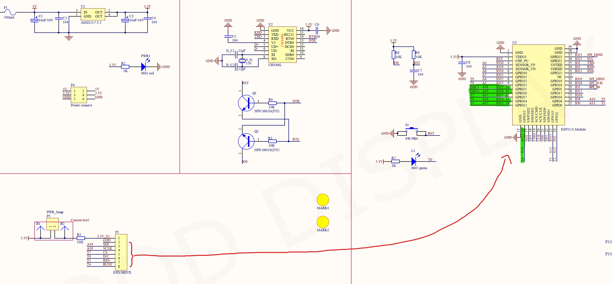

# GxEPD2-for-GD5.83-lolin32
Arduino Display Program for GoodDisplay 5.83" E-Paper Displays &amp; Wemos lolin32 ESP 32

## Hardware used
- GxEPD2_583_T8 (648*480)
- GoodDisplay Wemos lolin32 ESP 32

## Wiring

- static const uint8_t EPD_BUSY = 13;  // to EPD BUSY
- static const uint8_t EPD_CS   = 27;  // to EPD CS
- static const uint8_t EPD_RST  = 12; // to EPD RST
- static const uint8_t EPD_DC   = 14; // to EPD DC
- static const uint8_t EPD_SCK  = 25; // to EPD CLK
- static const uint8_t EPD_MISO = 19; // (Not sure)
- static const uint8_t EPD_MOSI = 26; // to EPD DIN

## Basic operators
- Everytime after update something -> Update display
    - display.display();

- Move cursor for drawing something
    - display.setCursor(2, 20); 

- Write something
    - display.print("Hello World!"); 

- Clean screen
    - display.fillScreen(GxEPD_WHITE); 
    - display.display();

- Rotation
    - display.setRotation(0); -> Horizontal (Head = up)
    - display.setRotation(1); -> Vertical (Head = right)
    - display.setRotation(2); -> Horizontal (Head = bottom)
    - display.setRotation(3); -> Vertical (Head = left)
    - display.setRotation(4); -> ?

## Reference
- https://github.com/ZinggJM/GxEPD2
- https://forum.arduino.cc/t/help-with-waveshare-epaper-display-with-adafruit-huzzah32-esp32-feather-board/574300/2

